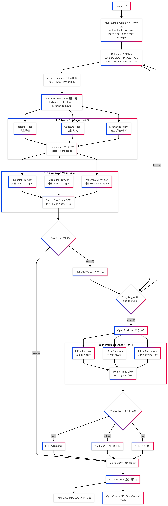

# Brale (Break a Leg) 🎭

- **An AI-driven multi-agent quantitative strategy engine**
- *If trading is a performance, then "Break a leg" means: may you trade brilliantly.*

## Project Background

Brale Core is designed to turn subjective trading judgment into an engineering workflow that is verifiable, executable, and auditable. The goal is to reduce emotional interference and improve execution consistency.

In code, this is reflected by:

- Driving decisions with rule chains and state machines instead of ad-hoc manual judgment.
- Separating decision-making, execution, risk control, and reconciliation into independent modules orchestrated at runtime.
- Prioritizing a "plan first, execute second" workflow with continuous monitoring during the position lifecycle.

## Core Features

- Multi-agent collaboration: Indicator / Structure / Mechanics evaluate independently across indicators, market structure, and trading mechanics, then cross-validate to reduce false signals from any single source.
- Three-path consensus decisioning: Indicator / Structure / Mechanics analysis must pass through Gate evaluation before execution.
- Explainable rule flow: RuleFlow outputs Gate / Plan / FSM artifacts, enabling full traceability of each decision cycle.
- Structured decision outputs: standardized Gate, Plan, and FSM outputs improve auditability, cross-module integration, automated replay, and secondary analysis.
- Controlled tighten risk logic: when the system enters the TIGHTEN path, it applies layered pre-execution thresholds (monitor hits, volatility limits, score thresholds, debounce windows, sentiment gates, etc.) to avoid overreacting to noise.
- Plan-first execution: generates entry / stop / take-profits / position-size / leverage before opening positions.
- Clear execution order layer: decouples decision logic from exchange connectivity using a unified adapter for order placement, query, and cancellation.
- Closed-loop position risk control: runs risk monitoring on price ticks and supports tighten / exit actions.
- Reconciliation and recovery: periodic reconcile + startup recovery to reduce state drift.
- Engineering-grade configuration: layered system / symbol / strategy config with hash binding.

## Architecture Overview

This project uses a layered collaborative runtime architecture that can be summarized into five parts: bootstrap assembly, runtime orchestration, decision layer, execution & risk layer, and data & interface layer.

### 1) Bootstrap Assembly Layer

The bootstrap assembly layer handles initialization and dependency wiring. The app enters from `cmd/brale-core/main.go`, then `bootstrap.Run(...)` loads configuration, builds core dependencies, and starts scheduling plus service interfaces.

### 2) Runtime Orchestration Layer

The runtime orchestration layer builds isolated runtime units per symbol, ensuring each instrument has an independent decision and execution context under the same framework. The core entry is `runtime.BuildSymbolRuntime(...)`, which assembles SnapshotFetcher, Compressor, Agent/Provider, Runner, and Pipeline.

### 3) Decision Layer

The decision layer is responsible for turning information into judgments. In each cycle, the system sequentially performs market snapshot fetching, feature compression, Agent/Provider evaluation, and RuleFlow inference, then produces structured outputs such as Gate, Plan, and FSM.

### 4) Execution and Risk Layer

The execution and risk layer converts decisions into trading actions and continuously controls risk during the position lifecycle. The execution side sends trade instructions through the Freqtrade adapter; the risk side enforces plan execution and dynamic monitoring around ExecutionPlan and RiskPlan.

### 5) Data and Interface Layer

The data and interface layer provides persistent state storage and external interaction. SQLite + GORM persist key records at the storage layer, while Runtime API, Webhook, and notification channels expose runtime control and status feedback.

## Data Sources

| Data Category | Primary Source / Implementation |
|---|---|
| Klines | Binance Futures market API |
| Open Interest (OI) | Binance Futures |
| Funding Rate | Binance Futures |
| Long/Short Ratio | Binance Futures |
| Fear & Greed | Dedicated FearGreed service |
| Liquidations | Binance Futures (window aggregation) |
| News Overlay | GDELT Doc API + LLM evaluation |
| Mark Price | Binance MarkPriceStream |
| Trade execution and account | Freqtrade API |

Note: At symbol level, configuration can decide whether OI/Funding/LongShort/FearGreed/Liquidations are strict requirements (see `SymbolRequire` in `internal/config/types.go`).

## Configuration Structure

The configuration system uses a three-layer structure: system-level, index-level, and strategy-level, so global behavior is decoupled from per-symbol strategy settings.

- System-level config: `configs/system.toml`, defines global capabilities such as execution system, Webhook, notifications, News Overlay, and LLM models.
- Index-level config: `configs/symbols-index.toml`, maintains mappings from symbols to config and strategy files.
- Strategy-level config: `configs/symbols/*.toml` and `configs/strategies/*.toml`, describes per-instrument parameters, risk controls, and strategy details.

For full configuration fields and structure definitions, see `internal/config/types.go`.

## ⚠️ Risk Disclaimer

- This project is for technical research, system development, and process validation only, and does not constitute investment advice.
- Digital asset trading is highly volatile and risky, and may result in partial or total loss of funds.
- Users must independently evaluate strategy, parameters, risk controls, and counterparty risks, and assume all consequences.
- Historical performance, backtest results, and sample configurations do not guarantee future returns.
- Before enabling production trading, perform thorough testing, monitoring, and contingency planning in an isolated environment.
